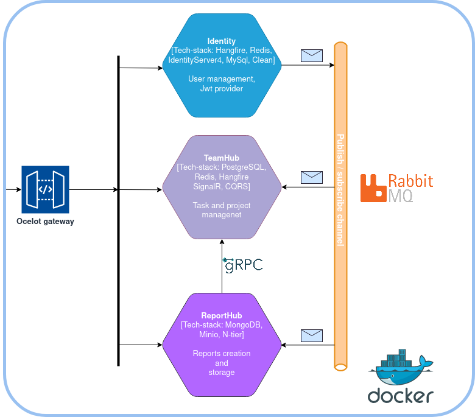

## Team-Task-Hub

#### Project overview

This project, similar to [ClickUp](https://clickup.com/), utilizes three microservices. It allows task creation, project organization, and efficient grouping of tasks and team members. Real-time commenting enhances communication, and the system enables the generation of project reports.

#### Microservices:
* Identity,
* TeamHub,
* ReportHub.

#### Technologies:
* **Backend:**
  - [ASP.NET Core 7.0](https://dotnet.microsoft.com/en-us/)
  - [Identity Server 4](https://identityserver4.readthedocs.io/en/latest/)
  - [Ocelot](https://github.com/ThreeMammals/Ocelot)

* **Microservice communication:**
  - [RabbitMQ](https://www.rabbitmq.com/)
  - [gRPC](https://grpc.io/)

* **Real-time Communication:**
  - [SignalR](https://learn.microsoft.com/en-us/aspnet/signalr/overview/getting-started/introduction-to-signalr)

* **Testing:**
  - [XUnit](https://xunit.net/)
  - [FluentAssertions](https://fluentassertions.com/)
  - [Moq](https://www.nuget.org/packages/Moq)

* **Logging and Monitoring:**
  - [Serilog](https://serilog.net/)
  - [Elasticsearch](https://www.elastic.co/elasticsearch)
  - [Kibana](https://www.elastic.co/kibana)

* **Database and Storage:**
  - [Entity Framework Core](https://learn.microsoft.com/en-us/ef/core/)
  - [MySql](https://www.mysql.com/)
  - [PostgreSQL](https://www.postgresql.org/)
  - [Redis](https://redis.io/)
  - [Minio](https://min.io/)

* **Additional libraries:**
  - [Hangfire](https://www.hangfire.io/)
  - [Swagger](https://learn.microsoft.com/en-us/aspnet/core/tutorials/web-api-help-pages-using-swagger?view=aspnetcore-7.0)
  - [AutoMapper](https://github.com/AutoMapper/AutoMapper)
  - [MediatR](https://github.com/jbogard/MediatR)
  - [FluentValidation](https://docs.fluentvalidation.net/en/latest/)

#### Project diagram

